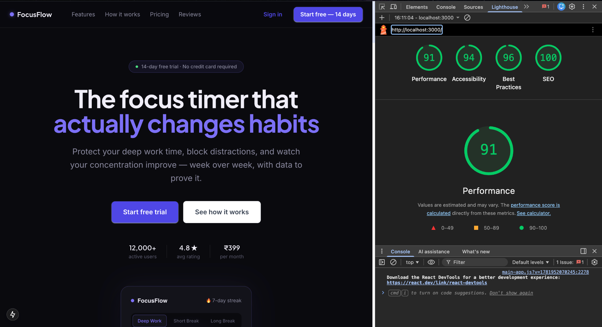

# FocusFlow — Next.js 15 Landing Page

A production-ready Next.js 15 (App Router) landing page for FocusFlow, a ₹399/mo focus-timer app.

## Preview



## Assignment Requirements Checklist

* [x] Next.js 15 App Router
* [x] Server-rendered marketing copy
* [x] Title & Meta Description
* [x] JSON-LD (SoftwareApplication)
* [x] CTA Analytics Event (`cta_clicked`)
* [x] Lighthouse Performance ≥ 90
* [x] Lighthouse SEO ≥ 90
* [x] Conversion Measurement Strategy

### Lighthouse Results

| Metric         | Score |
| -------------- | ----- |
| Performance    | 91    |
| Accessibility  | 94    |
| Best Practices | 96    |
| SEO            | 100   |

## Quick Start

```bash
npm install
npm run dev
npm run build
npm run start
```

## How I Would Measure Whether This Page Converts

### Conversion Funnel

Landing Page Visit

→ CTA Click (`cta_clicked`)

→ Trial Signup (`trial_started`)

→ Paid Subscription (`purchase_completed`)

### Primary Metric

**Visitor → Trial Conversion Rate**

Formula:

`Trial Signups ÷ Unique Landing Page Visitors`

This is the most important metric because the landing page's primary goal is to convince visitors to start a free trial.

### Secondary Metrics

* CTA Click Rate
* Scroll Depth
* Bounce Rate
* Visitor → Paid Conversion Rate

### Events Tracked

* `page_view`
* `cta_clicked`
* `trial_started`
* `purchase_completed`

### Validation Strategy

I would run A/B tests on:

1. Hero headline variations
2. CTA copy and placement
3. Pricing section positioning
4. Social proof presentation

Success would be measured by statistically significant improvements in Visitor → Trial Conversion Rate while maintaining or improving Visitor → Paid Conversion Rate.

### Example Diagnosis

* High CTA clicks + low trial signups → signup flow friction
* Low CTA clicks → weak value proposition
* Low scroll depth → above-the-fold experience needs improvement
* High trial signups + low paid conversions → onboarding or pricing issue

```
```
